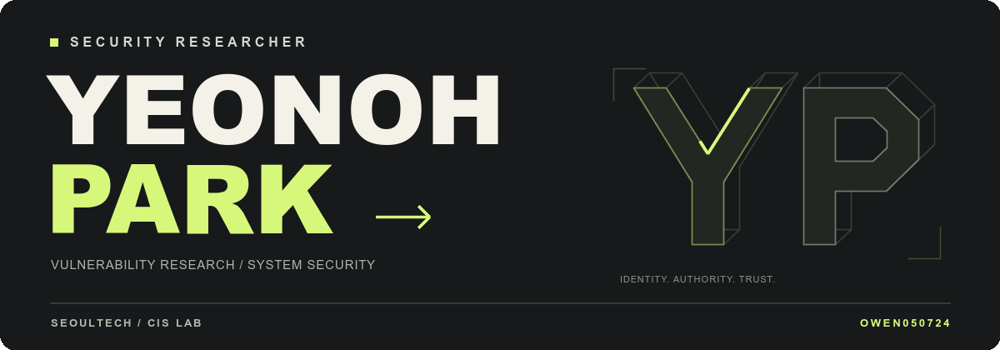
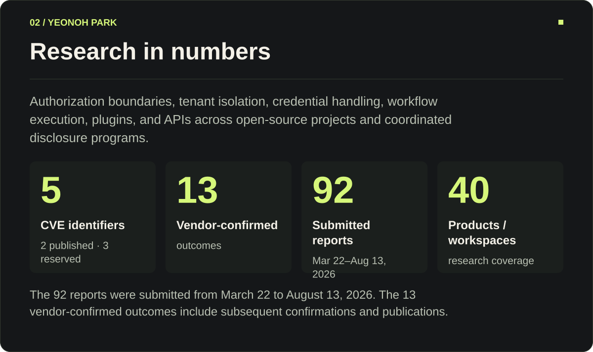
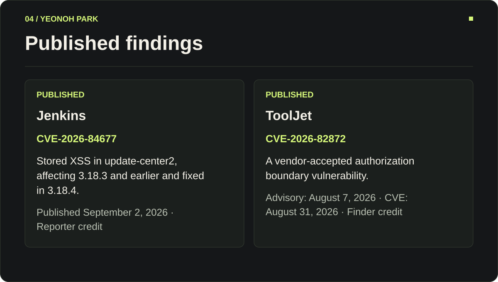
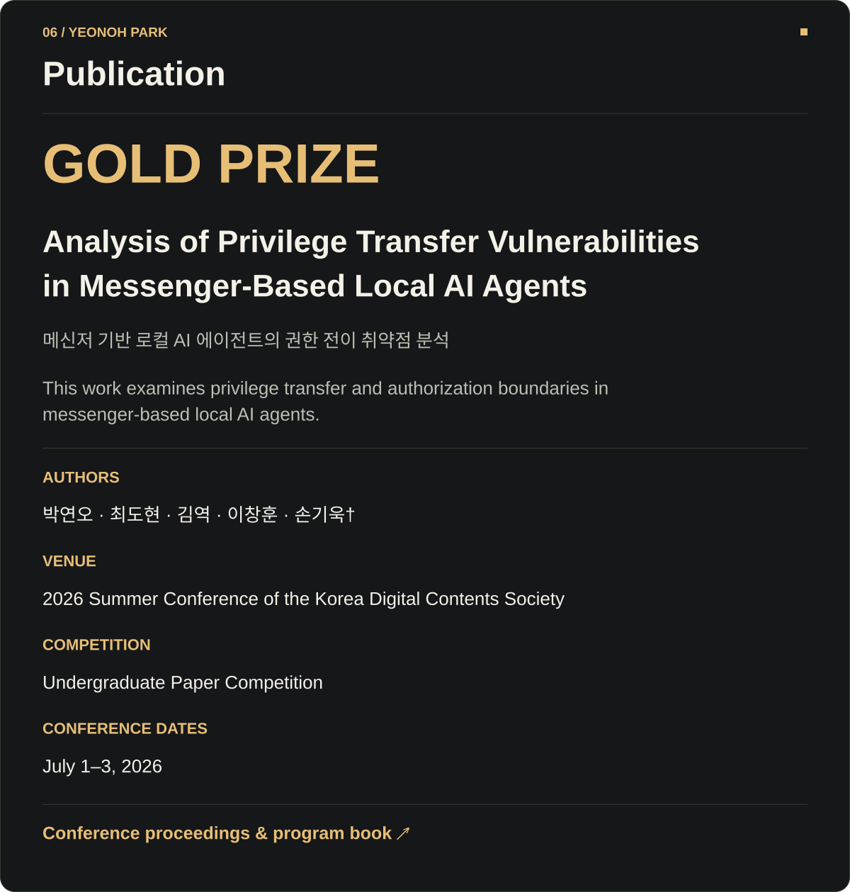
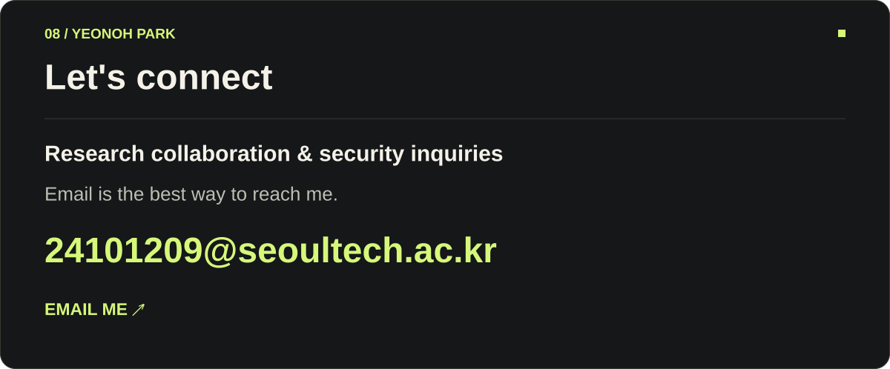

<!-- Generated from profile.json. To update: python3 scripts/render-profile.py -->

  <picture>
    <source media="(prefers-reduced-motion: reduce)" srcset="./assets/profile-header.svg">
    
  </picture>

  <picture>
    <source media="(max-width: 600px)" srcset="./assets/panels/about-mobile.svg">
    
  </picture>

  <picture>
    <source media="(max-width: 600px)" srcset="./assets/panels/research-mobile.svg">
    
  </picture>

  <picture>
    <source media="(max-width: 600px)" srcset="./assets/panels/method-mobile.svg">
    
  </picture>

  <picture>
    <source media="(max-width: 600px)" srcset="./assets/panels/published-mobile.svg">
    
  </picture>

  <a href="https://www.jenkins.io/security/advisory/2026-09-02/"><picture>
    <source media="(max-width: 600px)" srcset="./assets/panels/link-jenkins-mobile.svg">
    
  </picture></a>
  <a href="https://nvd.nist.gov/vuln/detail/cve-2026-82872"><picture>
    <source media="(max-width: 600px)" srcset="./assets/panels/link-tooljet-mobile.svg">
    
  </picture></a>

  <picture>
    <source media="(max-width: 600px)" srcset="./assets/panels/coordinated-mobile.svg">
    
  </picture>

  <a href="https://dcs.or.kr/conference/summer2026/notice/article/1086">
  <picture>
    <source media="(max-width: 600px)" srcset="./assets/panels/publication-mobile.svg">
    
  </picture>
</a>

  <picture>
    <source media="(max-width: 600px)" srcset="./assets/panels/background-mobile.svg">
    
  </picture>

  <a href="mailto:24101209@seoultech.ac.kr">
  <picture>
    <source media="(max-width: 600px)" srcset="./assets/panels/contact-mobile.svg">
    
  </picture>
</a>

  <a href="https://www.linkedin.com/in/yeonohpark/"><picture>
    <source media="(max-width: 600px)" srcset="./assets/panels/link-linkedin-mobile.svg">
    
  </picture></a>
  <a href="https://discord.com/users/495616210835079178"><picture>
    <source media="(max-width: 600px)" srcset="./assets/panels/link-discord-mobile.svg">
    
  </picture></a>
  <a href="https://www.instagram.com/dus_oh24/"><picture>
    <source media="(max-width: 600px)" srcset="./assets/panels/link-instagram-mobile.svg">
    
  </picture></a>

