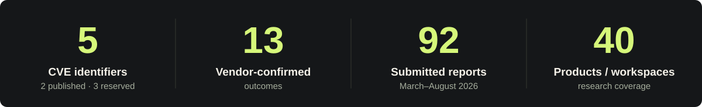

  <a href="https://owen050724.github.io/">
    <picture>
      <source media="(prefers-reduced-motion: reduce)" srcset="./assets/profile-header.svg">
      
    </picture>
  </a>

  <strong>Vulnerability Research &nbsp; / &nbsp; System Security &nbsp; / &nbsp; Cryptography</strong> 
  Computer Engineering undergraduate at <strong>SeoulTech</strong> 
  Undergraduate researcher · <strong>Cryptography Information Security Laboratory</strong>

  <a href="https://owen050724.github.io/"><strong>WEBSITE ↗</strong></a>
  &nbsp;&nbsp; / &nbsp;&nbsp;
  <a href="mailto:24101209@seoultech.ac.kr"><strong>EMAIL ↗</strong></a>
  &nbsp;&nbsp; / &nbsp;&nbsp;
  <a href="https://www.linkedin.com/in/yeonohpark/"><strong>LINKEDIN ↗</strong></a>

 

## 01 / Research record

I study how **identity, authority, and trust** move across software boundaries. My work focuses on authorization, tenant isolation, and the security of workflows, plugins, and APIs—with evidence-based validation and responsible disclosure.

<a href="https://owen050724.github.io/vulnerabilities/">
  <picture>
    <source media="(max-width: 600px)" srcset="./assets/research-snapshot-mobile.svg">
    
  </picture>
</a>

5 CVE identifiers: <strong>2 published · 3 reserved</strong>. The 92 submissions cover March 22–August 13, 2026. Outcome statuses follow the <a href="https://owen050724.github.io/vulnerabilities/">public research record</a>.

### Published highlights

- **Jenkins · [CVE-2026-84677](https://owen050724.github.io/vulnerabilities/#cve-2026-84677)** 
  Stored XSS in update-center2. **Published** · Fixed in 3.18.4 · Reporter credit.
- **ToolJet · [CVE-2026-82872](https://nvd.nist.gov/vuln/detail/cve-2026-82872)** 
  Authorization boundary vulnerability. **Published** · Finder credit.

<strong>Coordinated research · reserved CVEs and other outcomes</strong>

- **Dify · [CVE-2026-59210](https://owen050724.github.io/vulnerabilities/#cve-2026-59210)** — Accepted; fix shipped since 1.16.0. CVE reserved; advisory pending.
- **Apache DolphinScheduler · [CVE-2026-57590](https://owen050724.github.io/vulnerabilities/#cve-2026-57590) / [CVE-2026-66082](https://owen050724.github.io/vulnerabilities/#cve-2026-66082)** — Two vendor-confirmed findings. CVEs reserved; remediation and advisory details pending.
- **Grafana** — Accepted report; CVE, remediation, and advisory coordination pending.
- **ToolJet** — A separate accepted report; CVE assignment, remediation, and advisory publication pending.
- **authentik** — Vendor-validated report; fix verification, CVE assignment, and advisory publication pending.
- **Five additional coordinated outcomes** — Product identities and technical details remain private during coordinated disclosure.

**[Full research record ↗](https://owen050724.github.io/vulnerabilities/)** &nbsp; · &nbsp; [Research approach](https://owen050724.github.io/research/)

 

## 02 / Featured publication

<table>
  <tr>
    <td>
      
<strong>🏆 GOLD PRIZE &nbsp; / &nbsp; 2026</strong>

      <h3><a href="https://owen050724.github.io/publications/#messenger-based-local-ai-agent-security">Analysis of Privilege Transfer Vulnerabilities in Messenger-Based Local AI Agents</a></h3>
      
메신저 기반 로컬 AI 에이전트의 권한 전이 취약점 분석

      
2026 Summer Conference of the Korea Digital Contents Society Undergraduate Paper Competition

      

        <a href="https://owen050724.github.io/publications/#messenger-based-local-ai-agent-security"><strong>Publication details ↗</strong></a>
        &nbsp; · &nbsp;
        <a href="https://dcs.or.kr/conference/summer2026/notice/article/1086">Proceedings</a>
        &nbsp; · &nbsp;
        <a href="https://owen050724.github.io/assets/documents/2026-kdcs-gold-prize-certificate.pdf">Award certificate</a>
      

    </td>
  </tr>
</table>

 

## 03 / Beyond the research

**TCP** — Computer Science and Information Technology Club · Leader 
**STCE** — SeoulTech Crypto Engine · Member

<strong>Education &amp; selected honors</strong>

- **Seoul National University of Science and Technology** — B.S. in Computer Engineering, in progress · 2024–present
- **Busan Science High School** · 2021–2024

| Year | Recognition |
| :--- | :--- |
| 2024 | 12th K-Hackathon finalist · MATLAB Student AI Contest finalist |
| 2023 | Busan SW/AI Education Hackathon Grand Prize |
| 2022 | Busan Future Scientist Award Grand Prize |

[About me](https://owen050724.github.io/about/) · [All honors](https://owen050724.github.io/honors/)

 

---

  <strong>Research collaboration &amp; security inquiries</strong> 
  <a href="mailto:24101209@seoultech.ac.kr">24101209@seoultech.ac.kr</a> 
  <a href="https://owen050724.github.io/contact/">More ways to connect ↗</a>

